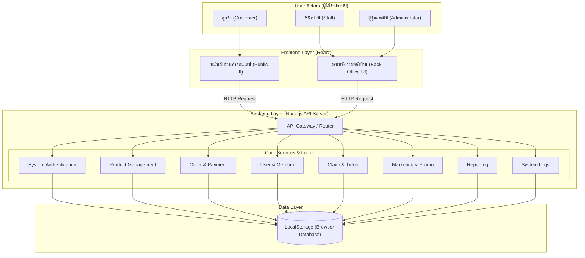

# PrimePC: ร้านค้าออนไลน์สำหรับจัดจำหน่ายอุปกรณ์คอมพิวเตอร์

Git Page https://saranyu311243.github.io/PrimePC/

## 1) ข้อมูลกลุ่ม (Group information)
- **ชื่อกลุ่ม:** ดรีมหลับ
- **จำนวนสมาชิก:** 5/5
- **1.67140410 นาย ศรัณยู แซ่ตั้ง** Project Manager / Testing
- **2.67124614 นาย วรพล เเสงพานิช** Frontend
- **3.67137113 นาย อภิชยุตม์ โรจน์สุกิจ** Frontend
- **4.67157971 นาย ธเนศวร ศรีทับทิม** Backend
- **5.67177222 นาย ธีระวัฒน์ ซู่** Backend / Testing

## 2) ชื่อโครงงาน (Project Title)
- **ชื่อโครงงาน (ภาษาไทย):** ร้านอุปกรณ์คอมพิวเตอร์ (PrimePC)
- **ชื่อโครงงาน (ภาษาอังกฤษ):** PrimePC

## 3) หลักการและเหตุผล (Rationale)
ในปัจจุบันเทคโนโลยีคอมพิวเตอร์มีการพัฒนาอย่างรวดเร็ว และมีความต้องการใช้งานสูงขึ้นทั้งในกลุ่มคนทำงาน เกมเมอร์ และนักเรียนนักศึกษา แต่อย่างไรก็ตาม ผู้ซื้อบางส่วนยังประสบปัญหาในการค้นหาอุปกรณ์ที่เข้ากันได้ หรือไม่มีแพลตฟอร์มที่รวมอุปกรณ์คอมพิวเตอร์ไว้อย่างครบครันและน่าเชื่อถือ ทางคณะผู้จัดทำจึงได้พัฒนาแพลตฟอร์ม **"PrimePC"** ขึ้นมา เพื่อเป็นร้านค้าออนไลน์ที่ช่วยให้ออกแบบ จัดหา และสั่งซื้ออุปกรณ์คอมพิวเตอร์ได้อย่างสะดวก รวดเร็ว และตอบโจทย์ความต้องการของผู้ใช้งานในยุคดิจิทัล

## 4) วัตถุประสงค์ของโครงงาน
1. พัฒนาแพลตฟอร์ม e-Commerce สำหรับซื้อขายอุปกรณ์คอมพิวเตอร์ที่มีประสิทธิภาพและใช้งานง่าย
2. เพื่ออำนวยความสะดวกให้ผู้ใช้งานสามารถค้นหา สั่งซื้อ และเลือกดูข้อมูลสเปกอุปกรณ์คอมพิวเตอร์ได้ครบจบในที่เดียว
3. เพื่อประยุกต์ใช้ความรู้ด้านดิจิทัลแพลตฟอร์มและการพัฒนาซอฟต์แวร์ตามกระบวนการ SDLC

## 5) ขอบเขตของระบบ (System Scope)

### ลูกค้า (Customer)
- สมัครสมาชิก และเข้าสู่ระบบ (Login)
- ค้นหาสินค้า คัดกรองประเภทอุปกรณ์ (เช่น CPU, GPU, RAM) และดูรายละเอียดสินค้า
- จัดการระบบตะกร้าสินค้า (เพิ่ม/ลด/ลบ) และทำรายการสั่งซื้อพร้อมแนบหลักฐานชำระเงิน
- จัดการข้อมูลบัญชีผู้ใช้ เช่น แก้ไขข้อมูลส่วนตัว เปลี่ยนรหัสผ่าน และจัดการที่อยู่สำหรับการจัดส่ง
- ติดตามสถานะคำสั่งซื้อ (เช่น รอชำระเงิน, กำลังจัดส่ง, จัดส่งสำเร็จ) และดูประวัติการสั่งซื้อ

### พนักงาน (Staff)
- จัดการข้อมูลและสถานะคลังสินค้า (Product & Stock Management): พนักงานสามารถเพิ่ม ลบ แก้ไข ข้อมูลสเปกและราคาอุปกรณ์คอมพิวเตอร์ (เช่น CPU, GPU, RAM) รวมถึงอัปเดตจำนวนสินค้าในระบบ LocalStorage ได้
- ตรวจสอบและเปลี่ยนสถานะคำสั่งซื้อ (Order Fulfillment): พนักงานสามารถดูรายการสั่งซื้อของลูกค้า ตรวจสอบหลักฐานการชำระเงินที่แนบมา และเปลี่ยนสถานะคำสั่งซื้อ (เช่น จาก "รอชำระเงิน" เป็น "กำลังจัดส่ง" หรือ "จัดส่งสำเร็จ")
- ระบบจัดการสมาชิกและสิทธิ์การใช้งาน (User Management): พนักงานสามารถค้นหา ดูรายชื่อบัญชีผู้ใช้ของลูกค้า และตรวจสอบประวัติการซื้อของสมาชิกแต่ละคนเพื่อใช้อ้างอิงในการให้บริการ
- ระบบแดชบอร์ดสรุปยอดขายเบื้องต้น (Sales Overview Dashboard): พนักงานสามารถดูยอดรวมการสั่งซื้อ จำนวนสินค้าที่ขายได้ และรายการสินค้าที่ใกล้หมดจากคลัง เพื่อช่วยในการวางแผนเติมสินค้า
- ระบบยืนยันและจัดการคำร้องเรียน/การเคลม (Ticket & Inquiry Handling): พนักงานสามารถเรียกดูข้อความการติดต่อหรือคำร้องเรียนจากหน้าบ้าน และเปลี่ยนสถานะการดำเนินงานเพื่อแจ้งกลับไปยังฝั่งลูกค้า

### ผู้ดูแลระบบ (Administrator)
- ระบบจัดการสิทธิ์และบัญชีผู้ใช้งาน (User & Role Management)
- สามารถสร้าง แก้ไข ระงับการใช้งาน หรือลบบัญชีผู้ใช้ของทั้งลูกค้าและพนักงานหน้าร้าน รวมถึงกำหนด/เปลี่ยนสิทธิ์การเข้าถึงระบบ (Roles) ให้พนักงานแต่ละคนได้
- สามารถตรวจสอบประวัติการทำงาน (Audit Logs) ของพนักงานในระบบเพื่อความโปร่งใส และจัดการล้างข้อมูลชั่วคราว (Clear Cache/Reset Data) ในระบบ LocalStorage/Server ในกรณีที่ต้องการรีเซ็ตระบบเพื่อทดสอบ (สอดคล้องกับแผน SDLC สัปดาห์ที่ 4)

## 6) แนวทางการพัฒนาตาม SDLC (Brief Description)
| ขั้นตอน (Phase) | รายละเอียดโดยย่อ (Brief Description) |
|---|---|
| 1. Planning | ประชุมวางแผนแบ่งงาน กำหนดหัวข้อโครงงาน "PrimePC" และจัดทำเอกสารขออนุมัติโครงงาน |
| 2. Analysis | รวบรวมความต้องการของระบบ (Requirements) และกำหนดขอบเขตหน้าที่ของ User แต่ละกลุ่ม |
| 3. Design | ออกแบบโครงสร้างฐานข้อมูล (ER-Diagram) และออกแบบหน้าจอผู้ใช้งาน (Wireframe/UI) |
| 4. Development | เขียนโค้ดพัฒนาโปรแกรมส่วน Frontend และ Backend พร้อมเชื่อมต่อฐานข้อมูลตามที่ออกแบบไว้ |
| 5. Testing | ทำการทดสอบระบบ (Manual Testing) ตามฟังก์ชันการทำงานเพื่อหาข้อผิดพลาด (Bug) และแก้ไข |
| 6. Deployment | นำระบบขึ้นระบบจำลองหรือแพลตฟอร์มเพื่อให้ผู้สอนและผู้เกี่ยวข้องสามารถเข้าใช้งานได้ |
| 7. Maintenance | ตรวจทานระบบหลังจากนำไปติดตั้ง ตรวจสอบ Feedback และสรุปผลโครงงาน |

## 7) เครื่องมือและเทคโนโลยีที่ใช้
- **Frontend:** React
- **Backend:** Node.js
- **Database:** Supabase

## 8) ประเภทการทดสอบ (Test Types)
- User Acceptance Testing (UAT)
- **เครื่องมือที่ใช้ (Tools)**
- Manual Testing

## 9) ผลลัพธ์ที่คาดว่าจะได้รับ
1. ได้แพลตฟอร์มร้านค้าออนไลน์ PrimePC ที่สามารถใช้งานซื้อขายอุปกรณ์คอมพิวเตอร์ได้จริงตามขอบเขตที่กำหนด
2. ผู้ใช้งานได้รับความสะดวกสบายในการเลือกซื้อและเข้าถึงข้อมูลอุปกรณ์คอมพิวเตอร์
3. ผู้จัดทำเข้าใจกระบวนการพัฒนาซอฟต์แวร์อย่างเป็นระบบตามหลัก SDLC และสามารถทำงานร่วมกันเป็นทีมได้อย่างมีประสิทธิภาพ

## 10) แผนการดำเนินงาน 4 สัปดาห์ (Work Plan)
| สัปดาห์ | รายละเอียดโดยย่อ |
|---|---|
| สัปดาห์ที่ 1 (วิเคราะห์และออกแบบระบบ) | ประชุมเก็บความต้องการ ออกแบบ Use Case, Database และสร้าง UI Prototype บน Figma |
| สัปดาห์ที่ 2 (พัฒนา Frontend) | พัฒนาหน้าจอ Interface ทั้งหมด (หน้าแรก, หน้ารายละเอียดสินค้า, ตะกร้าสินค้า, หน้า Admin) |
| สัปดาห์ที่ 3 (พัฒนา Backend และฐานข้อมูล) | พัฒนาระบบ API, ระบบ Login, จัดการฐานข้อมูลสินค้า และเชื่อมต่อหน้าบ้านเข้ากับหลังบ้าน |
| สัปดาห์ที่ 4 (ทดสอบระบบและนำเสนอผลงาน) | ทำการทดสอบระบบแบบ Manual เพื่อตรวจเช็คความถูกต้อง แก้ไขจุดบกพร่อง |

## Diagram

