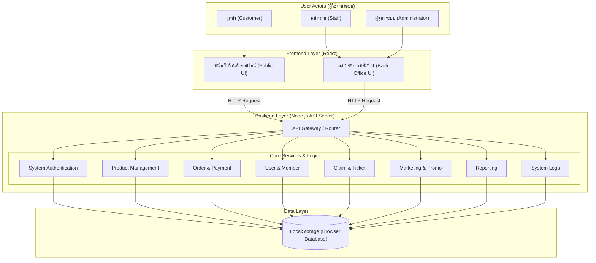

# PrimePC: ร้านค้าออนไลน์สำหรับจัดจำหน่ายอุปกรณ์คอมพิวเตอร์

Git Page https://saranyu311243.github.io/PrimePC/
หน้าเว็บจริง https://project-prime-pc.vercel.app/

## 1) ข้อมูลกลุ่ม (Group information)
- **ชื่อกลุ่ม:** ดรีมหลับ
- **จำนวนสมาชิก:** 5/5
- **1.67140410 นาย ศรัณยู แซ่ตั้ง** Project Manager / Testing
- **2.67124614 นาย วรพล เเสงพานิช** Frontend
- **3.67137113 นาย อภิชยุตม์ โรจน์สุกิจ** Frontend
- **4.67157971 นาย ธเนศวร ศรีทับทิม** Backend
- **5.67177222 นาย ธีระวัฒน์ ซู่** Backend / Testing

## 2) ชื่อโครงงาน (Project Title)
- **ชื่อโครงงาน (ภาษาไทย):** ร้านอุปกรณ์คอมพิวเตอร์ (PrimePC)
- **ชื่อโครงงาน (ภาษาอังกฤษ):** PrimePC

## 3) หลักการและเหตุผล (Rationale)
ในปัจจุบันเทคโนโลยีคอมพิวเตอร์มีการพัฒนาอย่างรวดเร็ว และมีความต้องการใช้งานสูงขึ้นทั้งในกลุ่มคนทำงาน เกมเมอร์ และนักเรียนนักศึกษา แต่อย่างไรก็ตาม ผู้ซื้อบางส่วนยังประสบปัญหาในการค้นหาอุปกรณ์ที่เข้ากันได้ หรือไม่มีแพลตฟอร์มที่รวมอุปกรณ์คอมพิวเตอร์ไว้อย่างครบครันและน่าเชื่อถือ ทางคณะผู้จัดทำจึงได้พัฒนาแพลตฟอร์ม **"PrimePC"** ขึ้นมา เพื่อเป็นร้านค้าออนไลน์ที่ช่วยให้ออกแบบ จัดหา และสั่งซื้ออุปกรณ์คอมพิวเตอร์ได้อย่างสะดวก รวดเร็ว และตอบโจทย์ความต้องการของผู้ใช้งานในยุคดิจิทัล

## 4) วัตถุประสงค์ของโครงงาน
1. พัฒนาแพลตฟอร์ม e-Commerce สำหรับซื้อขายอุปกรณ์คอมพิวเตอร์ที่มีประสิทธิภาพและใช้งานง่าย
2. เพื่ออำนวยความสะดวกให้ผู้ใช้งานสามารถค้นหา สั่งซื้อ และเลือกดูข้อมูลสเปกอุปกรณ์คอมพิวเตอร์ได้ครบจบในที่เดียว
3. เพื่อประยุกต์ใช้ความรู้ด้านดิจิทัลแพลตฟอร์มและการพัฒนาซอฟต์แวร์ตามกระบวนการ SDLC

## 5) ขอบเขตของระบบ (System Scope)

### ลูกค้า (Customer)
- สมัครสมาชิก 
- เข้าสู่ระบบ
- ค้นหาสินค้า
- จัดการระบบตะกร้าสินค้า (เพิ่ม/ลด/ลบ)
- เพิ่มสินค้าที่ถูกใจ
- แก้ไขข้อมูลลูกค้า (เปลี่ยนชื่อ ที่อยู่ เบอร์โทร)
- สั่งซื้อสินค้า
- ชำระสินค้า
- ติดตามสถานะคำสั่งซื้อ (รอชำระเงิน, กำลังจัดส่ง, จัดส่งสำเร็จ) 
- ดูประวัติการสั่งซื้อ
- ติดต่อสอบถาม

### พนักงาน (Staff)
- เข้าสู่ระบบ
- จัดการสินค้า
- ตรวจสอบคำสั่งซื้อ	
- ยืนยันการชำระเงิน
- อัปเดตสถานะการจัดส่ง
- แพ็กสินค้า
- ตอบคำถามลูกค้า

### ผู้ดูแลระบบ (Administrator)
- จัดการหมวดหมู่สินค้า (เพิ่ม/แก้ไข/ลบสินค้า)
- จัดการบัญชีผู้ใช้งานและสิทธิ์
- จัดการข้อมูลพนักงาน
- สรุปรายงานภาพรวม Dashboard (ยอดขาย, จำนวนผู้ใช้งาน)

## 6) แนวทางการพัฒนาตาม SDLC (Brief Description)
| ขั้นตอน (Phase) | รายละเอียดโดยย่อ (Brief Description) |
|---|---|
| 1. Planning | ประชุมวางแผนแบ่งงาน กำหนดหัวข้อโครงงาน "PrimePC" และจัดทำเอกสารขออนุมัติโครงงาน |
| 2. Analysis | รวบรวมความต้องการของระบบ (Requirements) และกำหนดขอบเขตหน้าที่ของ User แต่ละกลุ่ม |
| 3. Design | ออกแบบโครงสร้างฐานข้อมูล (ER-Diagram) และออกแบบหน้าจอผู้ใช้งาน (Wireframe/UI) |
| 4. Development | เขียนโค้ดพัฒนาโปรแกรมส่วน Frontend และ Backend พร้อมเชื่อมต่อฐานข้อมูลตามที่ออกแบบไว้ |
| 5. Testing | ทำการทดสอบระบบ (Manual Testing) ตามฟังก์ชันการทำงานเพื่อหาข้อผิดพลาด (Bug) และแก้ไข |
| 6. Deployment | นำระบบขึ้นระบบจำลองหรือแพลตฟอร์มเพื่อให้ผู้สอนและผู้เกี่ยวข้องสามารถเข้าใช้งานได้ |
| 7. Maintenance | ตรวจทานระบบหลังจากนำไปติดตั้ง ตรวจสอบ Feedback และสรุปผลโครงงาน |

## 7) เครื่องมือและเทคโนโลยีที่ใช้
- **Frontend:** Vite React Javascript TailwindCSS
- **Backend:** Node.js Express.js Cors PrismaORM
- **Database:** PostgresSQL Supabase  

## 8) ประเภทการทดสอบ (Test Types)
- User Acceptance Testing (UAT)
- **เครื่องมือที่ใช้ (Tools)**
- Manual Testing
- การทดสอบการทํางานของระบบด้วยตนเองตามฟังก์ชั่นพัฒนาพร้อมสาธิตการทํางานต่อผู้สอน
โดยอธิบายขั้นตอนการทดสอบผลลัพธ์คาดหวังและผลลัพธ์ที่เกิดขึ้นจริงเพื่อแสดงให้เหน็ว่าระบบทำงาน
ได้ถูกต้องตามวัตถุประสงค์ที่กำหนดไว้

## 9) ผลลัพธ์ที่คาดว่าจะได้รับ
1. ได้แพลตฟอร์มร้านค้าออนไลน์ PrimePC ที่สามารถใช้งานซื้อขายอุปกรณ์คอมพิวเตอร์ได้จริงตามขอบเขตที่กำหนด
2. ผู้ใช้งานได้รับความสะดวกสบายในการเลือกซื้อและเข้าถึงข้อมูลอุปกรณ์คอมพิวเตอร์
3. ผู้จัดทำเข้าใจกระบวนการพัฒนาซอฟต์แวร์อย่างเป็นระบบตามหลัก SDLC และสามารถทำงานร่วมกันเป็นทีมได้อย่างมีประสิทธิภาพ

## 10) แผนการดำเนินงาน 4 สัปดาห์ (Work Plan)
| สัปดาห์ | รายละเอียดโดยย่อ |
|---|---|
| สัปดาห์ที่ 1 (วิเคราะห์และออกแบบระบบ) | ประชุมเก็บความต้องการ ออกแบบ Use Case, Database และสร้าง UI Prototype บน Figma |
| สัปดาห์ที่ 2 (พัฒนา Frontend) | พัฒนาหน้าจอ Interface ทั้งหมด (หน้าแรก, หน้ารายละเอียดสินค้า, ตะกร้าสินค้า, หน้า Admin) |
| สัปดาห์ที่ 3 (พัฒนา Backend และฐานข้อมูล) | พัฒนาระบบ API, ระบบ Login, จัดการฐานข้อมูลสินค้า และเชื่อมต่อหน้าบ้านเข้ากับหลังบ้าน |
| สัปดาห์ที่ 4 (ทดสอบระบบและนำเสนอผลงาน) | ทำการทดสอบระบบแบบ Manual เพื่อตรวจเช็คความถูกต้อง แก้ไขจุดบกพร่อง |

## System Architecture

